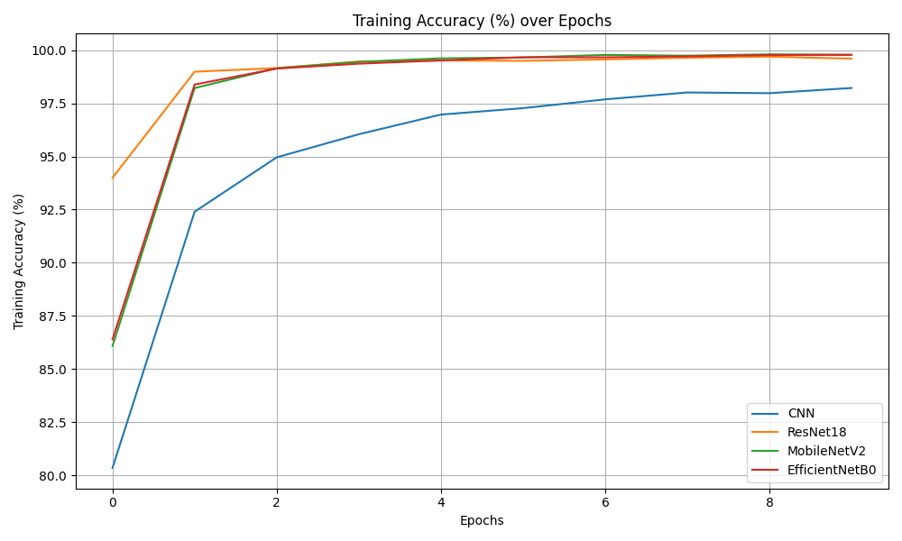
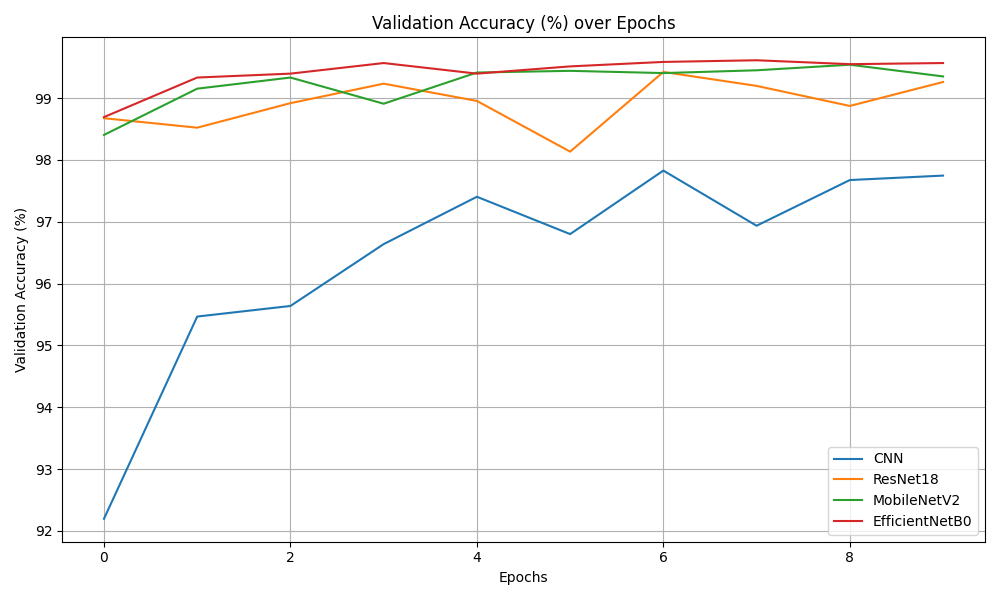

# 🌿 PlantDoc: AI-Powered Plant Disease Detection System
> "Empowering agriculture with AI — Detect plant diseases early and accurately."
---
## 📘 Table of Contents

* [Project Overview](#project-overview)
* [Objectives](#objectives)
* [Dataset](#dataset)
* [Models Used](#models-used)

  * [Custom CNN](1-custom-cnn)
  * [ResNet18](#2-resnet18)
  * [MobileNetV2](#3-mobilenetv2)
  * [EfficientNetB0](#4-efficientnetb0)
* [Model Training](#model-training)
* [Performance & Metrics](#performance--metrics)
* [Project Structure](#project-structure)
* [Web Application (Flask)](#web-application-flask)
* [Screenshots](#screenshots)
* [Visualizations](#visualizations)
* [Key Features](#key-features)
* [How to Use](#how-to-use)
* [Installation](#installation)
* [User Profile Page](#user-profile-page)
* [About Us Page](#about-us-page)
* [Future Work](#future-work)
* [Tech Stack](#tech-stack)
* [License](#license)
---
## 🌿 Project Overview

Plant diseases can cause significant agricultural loss. Early and accurate detection is crucial. This project aims to build a deep learning-based multi-crop disease detection system with 39 disease classes across 14 crop species.
The solution uses CNN architectures trained on curated datasets and is deployed as a web app for farmers, researchers, and agriculturalists.

---

## 🎯 Objectives

* Build a robust plant disease classifier.
* Support multiple crop types and diseases.
* Provide an easy-to-use web interface for predictions.
* Ensure accuracy, speed, and user-friendliness.

---

## 📁 Dataset

* **Name:** PlantVillage + Custom merged dataset.
* **Crops:** 14 crop types.
* **Dataset:** 54,000+ images.
* **Diseases:** 39 classes.
* **Image Size:** Resized to `128x128`.
* **Train/Val/Test Split:** \~80%/10%/10%.
* **Train Images:** 44,000+.
* **Validation Images:** 11,000+.

### Folder Structure:

```
dataset/
├── train/
│   ├── Tomato___Late_blight/
│   ├── Corn___Common_rust/
│   └── ...
├── val/
    └── ...
```

---

## 🧠 Models Used

### 1. Custom CNN

A lightweight convolutional neural network designed and trained from scratch.

```python
model = nn.Sequential(
    nn.Conv2d(3, 32, kernel_size=3, padding=1),
    nn.ReLU(),
    nn.MaxPool2d(2),
    ...
)
```
* Optimized for speed
* Good for low-resource environments
* Accuracy-97.83%

### 2. ResNet18

* Pretrained on ImageNet
* Fine-tuned for 39 plant disease classes
* Deep residual connections improve gradient flow
* Accuracy-99.42%

### 3. MobileNetV2

* Lightweight, mobile-friendly architecture
* Depthwise separable convolutions
* Fast and memory efficient
* Accuracy-99.54%

### 4. EfficientNetB0

* Balances depth, width, resolution
* Superior accuracy with fewer parameters
* Accuracy-99.61%

---

## 🧪 Model Training

* **Framework:** PyTorch
* **Input Size:** 128x128x3
* **Loss Function:** CrossEntropyLoss
* **Optimizers:** Adam
* **Augmentations:** Horizontal/Vertical flip, rotations
* **Callbacks:** Early stopping, checkpointing
* **Metrics Tracked:** Accuracy, Loss (train/val), F1

All models saved to:

```
model_cnn/cnn_best.pth
model_resnet18/resenet18_best.pth
model_efficientnet_b0/efficientnetb0_best.pth
model_mobilenetv2_best.pth 
```

---

## 📊 Performance & Metrics

| Model          | Accuracy  | Size    |
| -------------- | --------  | ------  |
| Custom CNN     | 97.83%    | \~128MB |
| ResNet18       | 99.42%    | \~43MB  |
| MobileNetV2    | 99.54%    | \~9MB   | 
| EfficientNetB0 | 99.61%    | \~16MB  |

All confusion matrices, training histories, and metrics are saved as `.pkl` or visualized with Matplotlib.

---

## 🗂️ Project Structure

```
my_project/
├── app.py
├── CNN.py
├── ResNet18.py
├── MobileNetV2.py
├── EfficientNetB0.py
├── predictions.py
├── confusion_matrix.py
├── requirements.txt
├── training/
│   ├── training_model.ipynb
│   ├── train_vs_val.py
│   ├── history_plot.py
│   ├── metrics_evaluation.py
│   ├── performance_summary.py
│   ├── data_split.py
│   ├── csv_predictions.py
│   └── true_labels.csv
├── static/
│   ├── assets/
│   │   ├── images/
│   │   │   └── model_diagram.png
│   │   └── css/
│   │       └── style.css
├── templates/
│   ├── index.html
│   ├── about.html
│   ├── result.html
│   └── profile.html
├── model_cnn/
│   ├── cnn_best.pth
│   ├── CONFUSION_MATRIX.png
│   └── METRICS.txt
├── model_resnet18/
│   ├── resnet18_best.pth
│   ├── CONFUSION_MATRIX.png
│   └── METRICS.txt
├── model_mobilenetv2/
│   ├── mobilenetv2_best.pth
│   ├── CONFUSION_MATRIX.png
│   └── METRICS.txt
├── model_efficientnet_b0/
│   ├── efficientnetb0_best.pth
│   ├── CONFUSION_MATRIX.png
│   └── METRICS.txt


```

---

## 🌐 Web Application (Flask)

Built using Flask to make the system interactive and usable via the browser.

### Key Features:

* Upload image and choose model.
* View prediction label and confidence.
* History of uploaded images per user.
* Animated About Us and Stats section.
* User login, signup, profile editing.

---

## 📸 Screenshots

### Homepage


### Market


### Upload & Predict


### Prediction


### Contact


### About


### FAQ


### Login Page


### Profile Page


### Services


---

## 📈 Visualizations

All models track and save:

* 📉 Training VS Validation Loss
 1. CNN
   
 2. Resnet18
   
 3. Mobilenetv2
   
 4.Efficientnetb0
   

* 📈 Training/Validation Accuracy
1.Train

2.Val


* 🧩 Confusion Matrix
 1. CNN
  
 2. Resnet18
  
 3. Mobilenetv2
  
 4.Efficientnetb0
  

 Generated using `matplotlib` and stored as:

```
cnn_history.pkl
mobilenetv2_history.pkl
resnet18_history.pkl
efficientnetb0_history.pkl
```

Confusion matrices saved and visualized with:

```bash
python confusion_matrix.py
```

---

## 🧩 Key Features

* 🌿 Multi-crop support (14 crops, 39 diseases).
* 📊 Model switching and comparison.
  
* 📸 Upload image for instant predictions.
* 🔐 Secure user authentication.
* 🧑‍💼 Profile editing and history.
  
* 📱 Mobile responsive UI.
* 🌐 Hosted using Flask.

---

## 🧑‍💻 How to Use

### 🖥️ From Localhost

1. Clone repository
```bash
git clone https://github.com/your-username/plantdoc.git
cd plantdoc
3. Activate virtual environment
python -m venv venv
source venv/bin/activate  # Linux/macOS
venv\Scripts\activate     # Windows
4. Install dependencies
pip install -r requirements.txt
5. Run `app.py`
6. Visit `http://localhost:5000`

```bash
git clone https://github.com/your-username/plantdoc
cd plantdoc
pip install -r requirements.txt
python app.py
```

### 🌐 Online Deployment

Use platforms like:

* Render
* Railway
* Heroku
* AWS EC2

---

## 📦 Installation

Install all dependencies:

```bash
pip install torch torchvision flask flask-login matplotlib scikit-learn
```

---

## 👤 User Profile Page

Features:

* View uploaded images.
* Profile picture support.
* Change name, email, password.
* See predictions history with timestamp.

> Stored using Flask-Login and SQLite3.

---

## 🧾 About Us Page

Includes:

* 🌟 Project intro
* 🔢 Animated counters for model performance
* 🧠 Feature list
* 🧪 Achievements
* 👩‍💻 Team members

Styled with Bootstrap ,FontAwesome, Custom CSS.

---

## 🚀 Future Work

* Android app version.
* Real-time camera-based detection.
* Farmer-friendly multilingual support.
* Weather + soil condition integration.

---

## 🧠 Tech Stack

| Layer      | Tools Used                                 |
| ---------- | ------------------------------------------ |
| Language   | Python                                     |
| Framework  | PyTorch, Flask                             |
| Frontend   | HTML, CSS, Bootstrap, JavaScript           |
| Models     | CNN, ResNet18, MobileNetV2, EfficientNetB0 |
| Deployment | Localhost, GitHub                          |
| Database   | SQLite3 (for user accounts)                |

---

## 📜 License

This project is licensed under the MIT License.
[MIT LICENSE](LICENSE)

---

## ❤️ Acknowledgments

* [PlantVillage Dataset](https://plantvillage.psu.edu/).
* PyTorch documentation.
* Bootstrap and Font Awesome.
* Google Colab for free training GPU.

---

